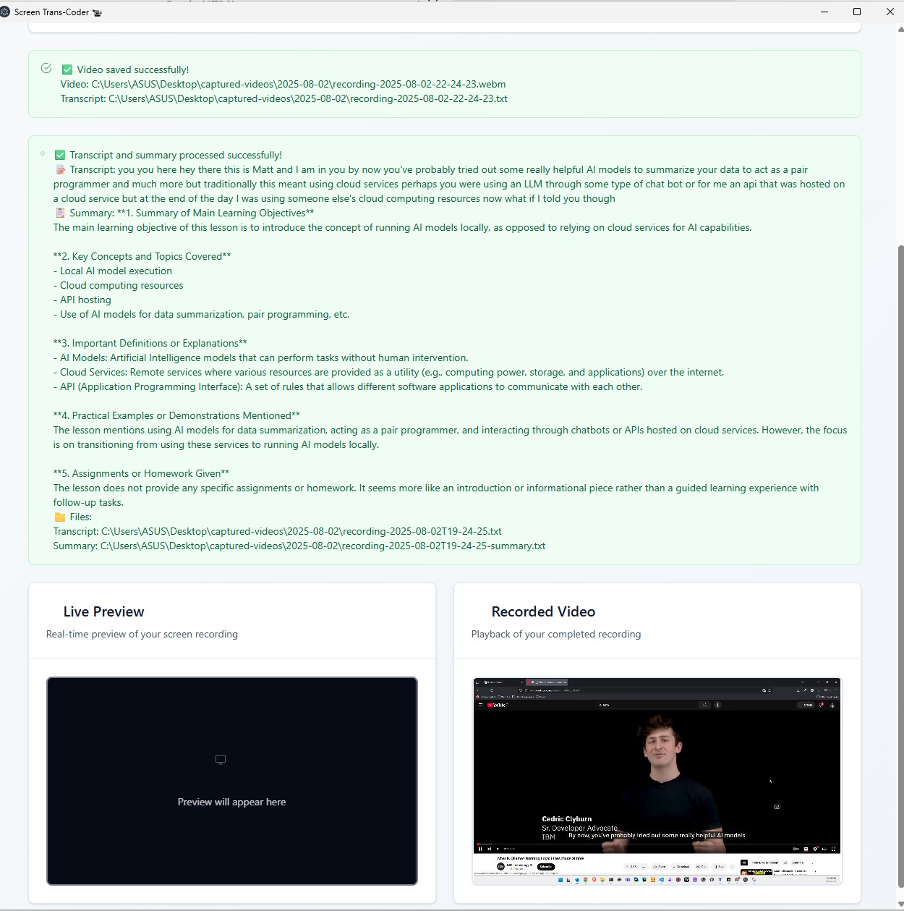

# Meeting Video Transrecorder


A powerful desktop application for recording meetings, lectures, and presentations with automatic transcript generation and AI-powered summarization. Built with Electron, React, and TypeScript.

## ✨ Features

- **🎥 Screen Recording** - Capture your entire screen or specific windows
- **📁 Smart File Organization** - Automatically saves to organized folders with timestamps
- **🎵 Audio Extraction** - Extracts audio from recorded videos for processing
- **📝 AI Transcript Generation** - Converts speech to text using local AI models
- **🤖 Intelligent Summarization** - Generates context-aware summaries using Ollama
- **🎯 Multiple Recording Types** - Optimized for Google Meet, Lessons, and general videos
- **👀 Live Preview** - See what you're recording in real-time
- **🔄 Cross-Platform** - Works seamlessly on Windows, macOS, and Linux
- **🔒 Privacy-First** - All processing happens locally, no data sent to external servers
- **⚡ Automated Setup** - One-command setup for all binary dependencies

## 📸 Screenshots

### Main Application Interface


### Recording in Progress



## 🚀 Quick Start

### Download Pre-built Binaries

The fastest way to get started:

1. **Visit [Releases](https://github.com/LinuxDevil/MeetingVideo-Transrecorder/releases)**
2. **Download for your platform:**
   - **Windows**: `meetingvideo-transrecorder-1.0.0-setup.exe`
   - **macOS**: `meetingvideo-transrecorder-1.0.0.dmg`
3. **Install and launch the application**

### Build from Source

For developers or those who need the latest features:

```bash
# Clone the repository
git clone https://github.com/LinuxDevil/MeetingVideo-Transrecorder
cd meetingvideo-transrecorder

# Install dependencies
npm install
pip install -r requirements.txt

# Start development server
npm run dev
```

## 📋 Requirements

### Essential Dependencies

| Component   | Version | Purpose                |
| ----------- | ------- | ---------------------- |
| **Node.js** | 16+     | Runtime environment    |
| **Python**  | 3.8+    | Audio processing       |
| **FFmpeg**  | Latest  | Video/audio conversion |

### Optional (for AI features)

| Component           | Purpose                          |
| ------------------- | -------------------------------- |
| **Ollama**          | Local AI model for summarization |
| **Python packages** | Speech-to-text processing        |

## 🛠️ Setup Guide

### Automated Setup (Recommended)

The easiest way to set up all binary dependencies:

```bash
# Setup for current platform (recommended)
./setup-binaries.sh

# Or setup for all platforms
./setup-binaries.sh all

# Or setup for specific platform
./setup-binaries.sh macos 
./setup-binaries.sh windows
./setup-binaries.sh linux
```

### What the Setup Script Does

#### macOS Setup
- Creates a Python virtual environment in `python-runtime/`
- Installs all dependencies from `requirements.txt`
- Downloads FFmpeg binary to `ffmpeg-bin/`

#### Windows Setup
- Downloads Python embeddable package to `python-runtime-windows/`
- Sets up pip and prepares for dependency installation
- Downloads FFmpeg binary to `ffmpeg-bin-windows/`

#### Linux Setup
- Creates a Python virtual environment in `python-runtime/`
- Installs all dependencies from `requirements.txt`
- Downloads static FFmpeg binary to `ffmpeg-bin/`

### Directory Structure After Setup

After running the setup script, you'll have:

```
├── python-runtime/          # macOS/Linux Python environment
├── python-runtime-windows/  # Windows Python environment
├── ffmpeg-bin/             # macOS/Linux FFmpeg binary
├── ffmpeg-bin-windows/     # Windows FFmpeg binary
├── audio_extractor.py      # Python script for audio processing
├── requirements.txt        # Python dependencies
└── setup-binaries.sh       # Setup script
```

### Windows Post-Setup

After running the Windows setup, manually install Python dependencies:

```bash
cd python-runtime-windows
python get-pip.py
Scripts/pip install -r ../requirements.txt
```

### Cross-Platform Builds

- Run `./setup-binaries.sh all` to set up binaries for all platforms
- Use the appropriate npm script for your target platform:
  ```bash
  npm run build:mac 
  npm run build:win 
  npm run build:linux
  ```

## 🛠️ Manual Installation Guide

### FFmpeg Setup

FFmpeg is required for audio extraction. Choose your platform:

#### Windows

```bash
# Using Chocolatey (recommended)
choco install ffmpeg

# Using Scoop
scoop install ffmpeg

# Manual installation
# Download from https://ffmpeg.org/download.html
# Extract to C:\ffmpeg and add C:\ffmpeg\bin to PATH
```

#### macOS

```bash
# Using Homebrew
brew install ffmpeg

# Manual installation
# Download from https://ffmpeg.org/download.html
# Extract to /usr/local/bin/
```

#### Linux

```bash
# Ubuntu/Debian
sudo apt update && sudo apt install ffmpeg

# CentOS/RHEL
sudo yum install ffmpeg

# Arch Linux
sudo pacman -S ffmpeg
```

### Ollama Setup (Optional)

For AI-powered summaries:

```bash
# 1. Download from https://ollama.ai/
# 2. Start Ollama service
ollama serve

# 3. Pull the required model
ollama pull mistral

# 4. Verify installation
ollama list
```

### Verification

Ensure everything is installed correctly:

```bash
# Check all dependencies
node --version
python --version
ffmpeg -version
ollama list  # if installed
```

### Setup Troubleshooting

#### "Python not found" error
- Make sure you've run `./setup-binaries.sh` first
- Check that the Python runtime was created successfully
- Verify the paths in `transcript.utils.ts` match your setup

#### "FFmpeg not found" error
- Ensure FFmpeg was downloaded by the setup script
- Check that the FFmpeg binary has execute permissions
- Verify the FFmpeg path is correct for your platform

### Manual Binary Setup (Alternative)

If the automated setup doesn't work, you can manually set up the binaries:

#### Python Runtime
1. Create a virtual environment: `python3 -m venv python-runtime`
2. Activate it: `source python-runtime/bin/activate` (macOS/Linux)
3. Install dependencies: `pip install -r requirements.txt`
4. Deactivate: `deactivate`

#### FFmpeg
1. Download from [FFmpeg website](https://ffmpeg.org/download.html)
2. Extract to `ffmpeg-bin/` directory
3. Ensure the binary is executable: `chmod +x ffmpeg-bin/ffmpeg`

### Python Dependencies

The app requires these Python packages (from `requirements.txt`):
- `openai-whisper>=20231117` - For speech-to-text conversion
- `SpeechRecognition>=3.10.0` - Alternative speech recognition
- `pydub>=0.25.1` - Audio processing
- `torch>=2.0.0` - Machine learning backend
- `numpy>=1.24.0` - Numerical computations

### Important Notes

#### Development vs Production

- **Development mode**: Uses system Python and FFmpeg
- **Packaged app**: Uses bundled Python runtime and FFmpeg

#### Gitignore

The binary directories are automatically ignored by git:
- `python-runtime/`
- `python-runtime-windows/`
- `ffmpeg-bin/`
- `ffmpeg-bin-windows/`

This keeps the repository clean while allowing developers to set up their own binaries.

## 🎯 Usage

### Basic Recording Workflow

1. **Launch the application**
2. **Select recording type** (Google Meet, Lesson, or Video)
3. **Click "Start Recording"**
4. **Present your content**
5. **Click "Stop Recording"**
6. **Download your video**

### Advanced Features

#### Transcript Generation

After recording:

1. **Click "Extract Transcript"**
2. **Wait for processing** (audio extraction + speech recognition)
3. **Review the transcript** and AI-generated summary
4. **Files are saved** to your desktop automatically

#### File Organization

Your recordings are automatically organized:

```
Desktop/
└── captured-videos/
    └── 2024-01-15/
        ├── recording-2024-01-15-14-30-25.webm
        ├── recording-2024-01-15-14-30-25.txt
        └── recording-2024-01-15-14-30-25-summary.txt
```

## ⚙️ Configuration

### Recording Types

| Type            | Purpose             | Summary Focus                               |
| --------------- | ------------------- | ------------------------------------------- |
| **Google Meet** | Meeting recordings  | Action items, decisions, assignments        |
| **Lesson**      | Educational content | Learning objectives, key concepts, homework |
| **Video**       | General content     | Main points, highlights, insights           |

### AI Model Configuration

Change the AI model in `src/main/utils/ollama.utils.ts`:

```typescript
model: 'mistral' // Change to any model you have installed
```

### Speech-to-Text Engines

The app supports multiple STT options:

1. **OpenAI Whisper** (Local) - Default, works offline
2. **Google Speech Recognition** (Online) - Fallback option
3. **Fallback** - Simple text if other options fail

## 🔧 Development

### Development Server

```bash
npm run dev
```

### Building for Production

```bash
# Windows
npm run build:win

# macOS
npm run build:mac

# Linux
npm run build:linux
```

## 🐛 Troubleshooting

### Common Issues

#### FFmpeg Not Found

```bash
# Verify installation
ffmpeg -version

# Add to PATH if needed
# Windows: Add C:\ffmpeg\bin to system PATH
# macOS/Linux: Ensure it's in /usr/local/bin/
```

#### Ollama Connection Issues

```bash
# Start Ollama service
ollama serve

# Check available models
ollama list

# Pull required model
ollama pull mistral

# Test connection
curl http://localhost:11434/api/tags
```

#### Python Dependencies

```bash
# Install requirements
pip install -r requirements.txt

# Verify audio_extractor.py exists
ls audio_extractor.py
```

#### Desktop Sources Not Found

- This is normal on first run
- The app will automatically detect available screens
- Try refreshing or restarting the application

### Debug Mode

Run with enhanced logging:

```bash
npm run dev -- --debug
```

### Manual Setup

Use the automated setup script:

```bash
python setup.py
```

## 🏗️ Project Structure

```
meetingvideo-transrecorder/
├── src/
│   ├── main/           # Electron main process
│   │   ├── handlers/   # IPC handlers
│   │   ├── types/      # TypeScript types
│   │   ├── utils/      # Utility functions
│   │   └── window.ts   # Window management
│   ├── preload/        # Preload scripts
│   │   ├── types/      # Type definitions
│   │   ├── utils/      # API utilities
│   │   └── index.ts    # Main preload
│   └── renderer/       # React frontend
│       ├── components/ # UI components
│       ├── hooks/      # Custom hooks
│       ├── types/      # TypeScript types
│       └── utils/      # Utility functions
├── resources/          # App resources
├── audio_extractor.py  # Python audio processing
├── requirements.txt    # Python dependencies
└── package.json        # Node.js dependencies
```

## 🤝 Contributing

We welcome contributions! Here's how to get started:

1. **Fork the repository**
2. **Create a feature branch**: `git checkout -b feature-name`
3. **Make your changes**
4. **Test thoroughly**
5. **Submit a pull request**

### Development Guidelines

- Follow TypeScript best practices
- Use meaningful commit messages
- Test on multiple platforms
- Update documentation as needed

## 📄 License

This project is licensed under the MIT License - see the [LICENSE](LICENSE) file for details.

## 🆘 Support

### Getting Help

1. **Check the troubleshooting section above**
2. **Review console output for error messages**
3. **Ensure all prerequisites are installed**
4. **Try running in debug mode**
5. **Check [GitHub Issues](https://github.com/LinuxDevil/MeetingVideo-Transrecorder/issues)**

### Community

- **GitHub Issues**: Report bugs and request features
- **Discussions**: Ask questions and share ideas
- **Releases**: Download the latest versions

## 🔄 Continuous Integration

This project uses GitHub Actions for automated builds and releases.

### Workflows

#### Build Artifacts (`build-artifacts.yml`)

- **Triggers**: Push to `main`, pull requests, manual
- **Purpose**: Build Windows and macOS versions
- **Output**: Uploads artifacts for manual download

#### Build and Release (`build.yml`)

- **Triggers**: Tags starting with `v*` (e.g., `v1.0.1`)
- **Purpose**: Creates GitHub releases with artifacts
- **Output**: Automatic release with downloadable files

### Using Release Scripts

**Linux/macOS:**

```bash
chmod +x scripts/release.sh
./scripts/release.sh 1.0.1
```

**Windows:**

```cmd
scripts\release.bat 1.0.1
```

### Manual Builds

1. **Go to [Actions](https://github.com/LinuxDevil/MeetingVideo-Transrecorder/actions)**
2. **Click "Build Artifacts"**
3. **Click "Run workflow"**
4. **Select branch and run**

### Build Matrix

| Platform | Runner           | Build Command       | Output                  |
| -------- | ---------------- | ------------------- | ----------------------- |
| Windows  | `windows-latest` | `npm run build:win` | `.exe`, `win-unpacked/` |
| macOS    | `macos-latest`   | `npm run build:mac` | `.dmg`, `mac/`          |

### Artifacts

- **Build Artifacts**: Available in Actions tab (30-day retention)
- **Release Artifacts**: Available on Releases page (permanent)

### Recent Updates

- ✅ **Modular Architecture** - Refactored for better maintainability
- ✅ **CSS Refactoring** - Improved styling with @apply directives
- ✅ **GitHub Actions** - Automated builds and releases
- ✅ **Cross-platform Support** - Windows and macOS builds
- ✅ **AI Integration** - Local AI-powered summarization

---

**Made with ❤️ by [LinuxDevil](https://github.com/LinuxDevil)**
